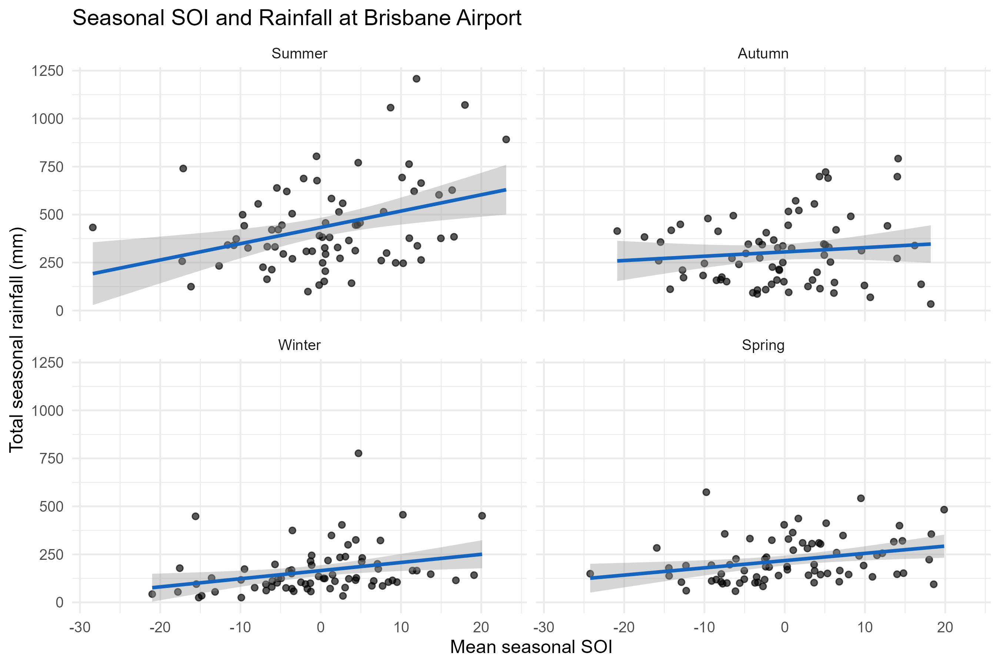
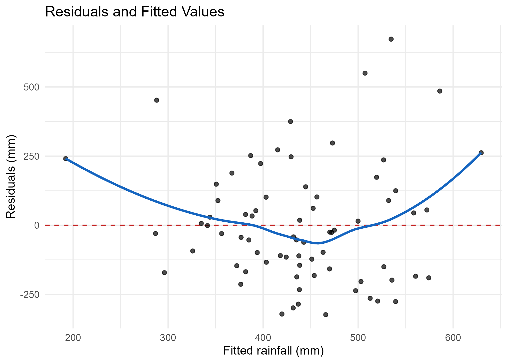
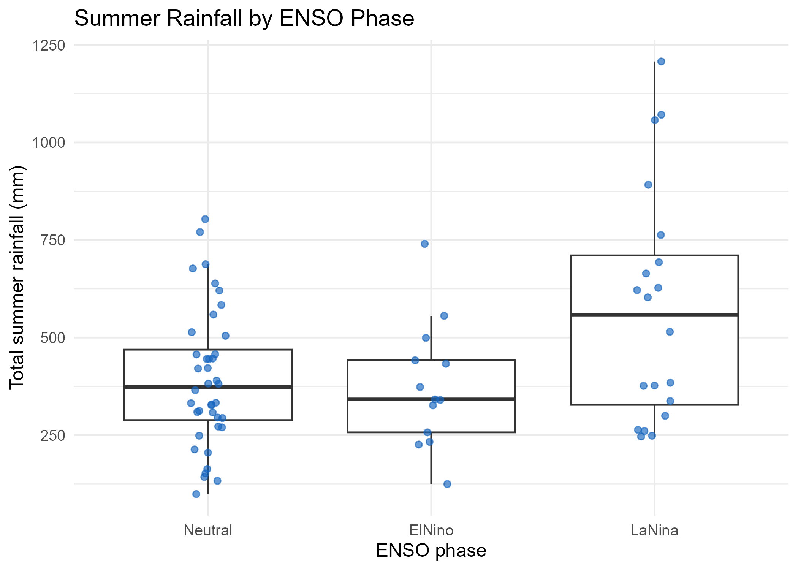

# ENSO and Summer Rainfall Analysis in Brisbane

## Overview

This project investigates how the El Nino-Southern Oscillation (ENSO) relates to seasonal rainfall at Brisbane Airport. Using R, I combined seasonal rainfall records with the Southern Oscillation Index (SOI), compared seasonal relationships, and evaluated linear, quadratic, and categorical models.

The analysis found that positive SOI values and La Nina conditions were associated with higher summer rainfall. However, ENSO explained only a limited proportion of rainfall variability, making these models more useful for understanding climate relationships than for standalone rainfall forecasting.



## Research Questions

- How does seasonal SOI relate to total seasonal rainfall?
- In which season is the relationship strongest?
- Does a quadratic model fit summer rainfall better than a simple linear model?
- Do average summer rainfall levels differ among El Nino, Neutral, and La Nina phases?
- How reliable are SOI and ENSO phase as explanatory or predictive variables?

## Data

The rainfall and SOI datasets were joined by `Year` and `Season`. After selecting the required variables and removing incomplete observations, 292 records remained, with 73 observations for each season.

The summer subset contained:

| ENSO phase | Observations |
|---|---:|
| Neutral | 40 |
| El Nino | 13 |
| La Nina | 20 |

The datasets were supplied through QUT Canvas for coursework and are not redistributed in this repository. Authorised users can place `total_seasonal_rainfall.csv` and `seasonal_soi_data.csv` in the local `data/` directory to reproduce the analysis.

## Tools and Methods

- R, tidyverse, ggplot2, and broom
- Data joining, cleaning, and transformation
- Exploratory data visualisation
- Simple and quadratic regression
- Residual and model diagnostics
- Classical and Welch one-way ANOVA
- Tukey multiple comparisons
- Categorical regression
- Chi-square goodness-of-fit testing

## Results

### Seasonal SOI Relationships

All seasons except autumn showed statistically significant positive SOI slopes. Summer had the largest estimated change in rainfall per one-unit increase in SOI.

| Season | SOI slope (mm) | 95% confidence interval | p-value |
|---|---:|---:|---:|
| Summer | 8.49 | 3.15 to 13.83 | 0.00226 |
| Autumn | 2.25 | -2.50 to 6.99 | 0.34900 |
| Winter | 4.24 | 0.97 to 7.50 | 0.01180 |
| Spring | 3.78 | 0.95 to 6.60 | 0.00956 |

Summer was selected for detailed modelling because it had the strongest estimated SOI association.

### Linear and Quadratic Models

The simple linear model estimated an increase of approximately 8.49 mm in summer rainfall for each one-unit increase in seasonal SOI. Its slope was statistically significant, but the model explained only 12.4% of rainfall variability.

| Model | R-squared | Adjusted R-squared | AIC |
|---|---:|---:|---:|
| Simple linear | 0.124 | 0.112 | 995 |
| Quadratic | 0.188 | 0.165 | 991 |

The quadratic model was:

```text
Predicted rainfall = 394.67 + 8.67(SOI) + 0.437(SOI^2)
```

The quadratic term was significant (`p = 0.0213`), and a nested-model ANOVA confirmed that it improved fit over the simple linear model (`F = 5.5488`, `p = 0.0213`). The quadratic model also had a lower AIC and explained 18.8% of rainfall variability.

### Prediction Intervals

The quadratic model produced the following 95% prediction intervals:

| SOI | Predicted rainfall (mm) | 95% prediction interval (mm) |
|---:|---:|---:|
| -25 | 451.24 | -28.48 to 930.96 |
| 25 | 884.65 | 403.93 to 1365.37 |

The intervals are very wide. The interval at SOI = -25 includes negative rainfall, which is physically impossible and demonstrates the model's limited reliability at extreme values.

### Model Diagnostics



The smooth curve in the residual plot shows a systematic nonlinear pattern rather than random scatter around zero. This supports the inclusion of a quadratic term. Several large positive and negative residuals also show that SOI alone does not capture much of the variation in summer rainfall.

### Rainfall by ENSO Phase



The boxplot shows higher rainfall and greater variability during La Nina conditions. A classical one-way ANOVA found differences among ENSO phases (`F = 5.534`, `p = 0.00587`).

Bartlett's test indicated unequal variances (`K-squared = 9.4706`, `p = 0.00878`), so a Welch ANOVA was also conducted. The Welch result remained statistically significant, although it was closer to the 5% threshold (`F = 3.4487`, `p = 0.04536`).

Classical Tukey comparisons found:

| Comparison | Mean difference (mm) | 95% confidence interval | Adjusted p-value |
|---|---:|---:|---:|
| El Nino - Neutral | -16.44 | -180.41 to 147.53 | 0.9687 |
| La Nina - Neutral | 182.74 | 42.08 to 323.40 | 0.0075 |
| La Nina - El Nino | 199.18 | 16.21 to 382.16 | 0.0297 |

Because Tukey's method assumes equal variances, these pairwise results should be interpreted cautiously. A future version could use Games-Howell comparisons as a variance-robust alternative.

### Categorical Regression

Using Neutral as the reference category, the categorical regression estimated:

- El Nino: 16.44 mm lower rainfall than Neutral (`p = 0.811`)
- La Nina: 182.74 mm higher rainfall than Neutral (`p = 0.00270`, 95% CI: 65.6 to 300.0 mm)

The categorical model explained 13.7% of summer rainfall variability. This is consistent with the ANOVA results but confirms that ENSO phase alone has limited explanatory power.

### ENSO Phase Frequencies

A chi-square goodness-of-fit test rejected the hypothesis that the three phases occurred equally often (`X-squared = 16.137`, `df = 2`, `p = 0.0003133`). Neutral conditions occurred more often than expected, while El Nino conditions occurred less often than expected.

## Conclusion

ENSO was significantly associated with summer rainfall at Brisbane Airport. Summer had the strongest SOI slope, and La Nina conditions were associated with substantially higher average rainfall than Neutral or El Nino conditions.

The quadratic model improved on the simple linear model, and the ENSO phase difference remained significant under Welch's unequal-variance ANOVA. Nevertheless, the low R-squared values, wide prediction intervals, unequal variances, and residual patterns show that ENSO is only one contributor to rainfall variability. Additional climate predictors and models designed for non-negative, heteroscedastic rainfall data would be needed for reliable forecasting.

## Repository Structure

```text
enso-rainfall-analysis-r/
|-- README.md
|-- enso_rainfall_analysis.R
|-- data/
|   `-- README.md
|-- figures/
|   |-- seasonal_soi_rainfall.png
|   |-- linear_model_residuals.png
|   `-- rainfall_by_enso_phase.png
|-- .gitignore
`-- LICENSE
```

The input CSV files are stored locally in `data/` but excluded from Git with `.gitignore`.

## Running the Analysis

Install the required packages:

```r
install.packages(c("tidyverse", "broom"))
```

Place the authorised CSV files in `data/`, then run:

```r
source("enso_rainfall_analysis.R")
```

The script prints the statistical results and saves the visualisations in `figures/`.

## Limitations and Future Work

- The analysis covers a single weather station and 73 summer observations.
- SOI and ENSO phase explain only a small proportion of rainfall variability.
- Unequal phase variances weaken the assumptions behind classical ANOVA and Tukey comparisons.
- The models do not account for temporal dependence or other climate drivers.
- Future work could add Games-Howell comparisons, cross-validation, additional climate variables, and models that constrain rainfall predictions to non-negative values.

## Climate Context

Further background on ENSO and SOI is available from the [Australian Bureau of Meteorology](http://www.bom.gov.au/climate/enso/).

## License

The source code in this repository is available under the MIT License. The datasets are not included in the MIT License and are not redistributed through this repository. They remain subject to the terms of their original providers.
